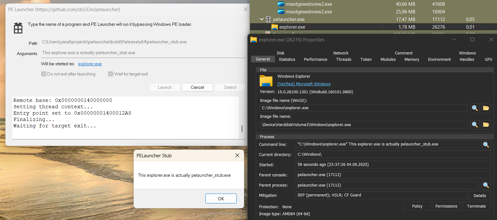
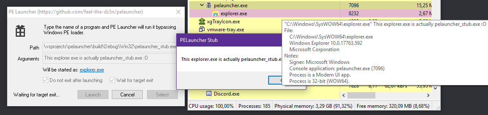
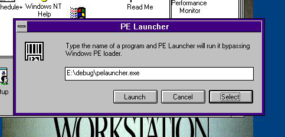

# Portable Executable Launcher for Windows NT 

# What is this?

This tool tricks the Windows NT low‑level Portable Executable (`.exe`) loader. It starts a valid executable and then replaces its in‑memory image with another PE of your choice, even if Windows refuses to load the target executable.

# Download
Visit [artifacts page on AppVeyor](https://ci.appveyor.com/project/dz333n/pelauncher/build/artifacts)

# Screenshots

### 2025

### 2020

### 2019

# How does this work?

1. PE Launcher starts `stub.exe` (any valid executable; user configurable) in a suspended state.
2. Windows NT creates the `stub.exe` process and loads its image into memory.
3. PE Launcher reads `target.exe` from disk.
4. It replaces the in‑memory image of `stub.exe` with sections/resources from `target.exe`.
5. Although Windows NT validated and loaded `stub.exe`, the image in memory is now `target.exe`.
6. PE Launcher resumes the process.
7. Windows NT begins executing the app.

# Why?

No particular reason - this was made for fun.

- Start Windows CE applications (with [WCECL](https://github.com/feel-the-dz3n/wcecl)) without modifying the executable.
- Attempt to start the Windows kernel in user space (likely won't work; it tends to fail DLL resolution).
- Windows 10 refuses to launch the Windows XP setup (`winnt32.exe`). PELauncher can trick the system and start this soft‑locked setup on modern Windows. However, it currently fails to resolve `winnt32u.dll` (investigation is needed)
- Run native NT executables in Win32 user space. Fun fact: probably a Windows issue, but running the 32‑bit `smss.exe` (e.g., the Windows XP version) on Windows 11 can crash the system completely, even without administrator privileges.
- May bypass some antivirus checks.

# Limitations and issues

1. **Shitcode**. This was shitcoded by me a few years ago, so be aware that there may be code issues and memory leaks.
2. Compatibility: Works well on Windows 10. ~~It also ran on XP~~ (2025 update: the Windows XP build no longer works due to `v141_xp` toolset deprecation). The program does not work on Vista or 7, for some reason. (Actually, I'm not sure if the modern toolset targets Win 6.x)
 
# Build

Open `pelauncher.sln` in Visual Studio 2022 and build with the latest MSVC toolset.

~~Visual Studio 2017 was used to create this project.~~ (ported to VS2022 due to deprecations)

# Credits
- [This](https://stackoverflow.com/questions/48981582/running-portable-executable-in-memory-using-the-winapi-c-programming) question on Stackoverflow
